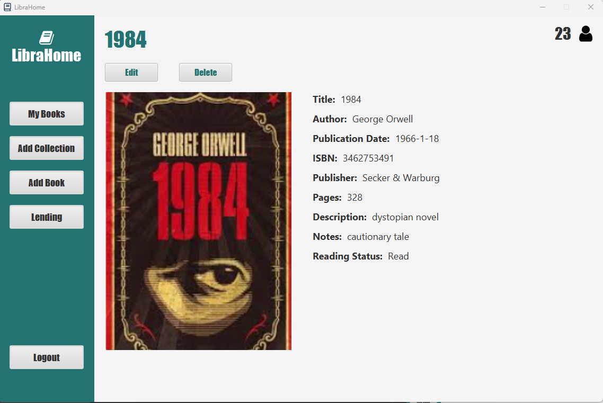
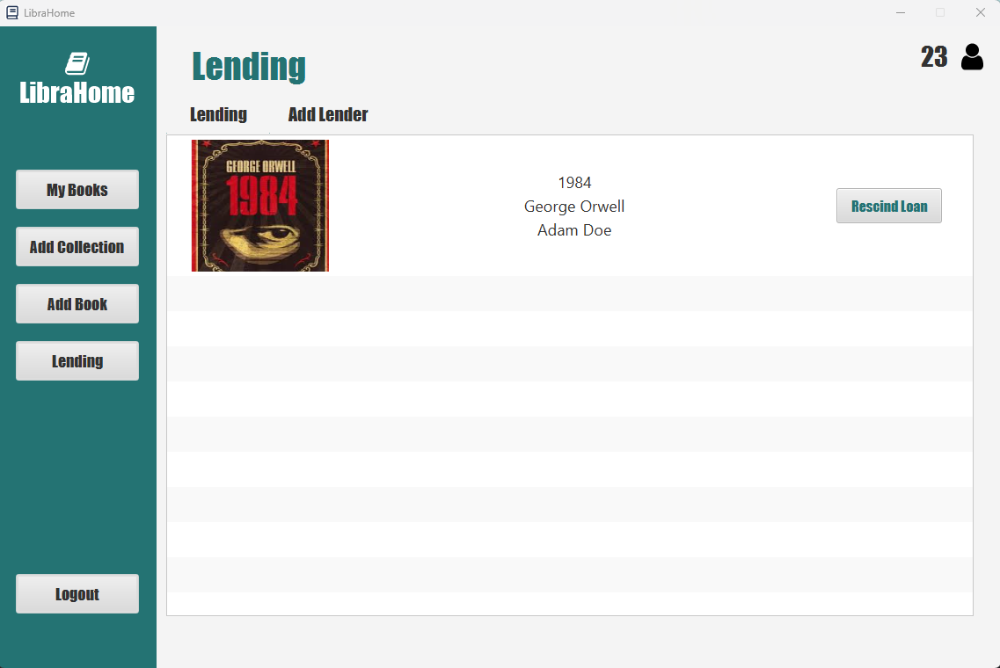

# LibraHome

**LibraHome** is a JavaFX-based application designed to efficiently manage a personal collection of books. The application allows users to catalog their home library, track borrowed books, and interact with their collection through various features such as web scraping for book information, rating and reviews, and wish lists.

## Features

- **Book Management:**
    - Add collections to organize books.
    - Add books manually or using the web scraping tool powered by jSOUP to retrieve book information from online sources.
    - Edit, delete, or loan individual books.
    - For each book, users can input the title, author, publisher, ISBN, publication date, description, notes, and upload a cover image.
- **Search and Sort:**
    - Search for books by title, author, publisher, or publication date.
    - Sort books alphabetically by title, author, or by publication date (oldest to newest).
- **Borrowing Management:**
    - Track books lent out, including borrower details and return date reminders.
- **Reading History:**
    - Track reading progress, including start and end dates.
    - Maintain a log of completed books with ratings.
- **Wish Lists:**
    - Create and manage lists for future book purchases or reading.
- **Web Scraping:**
    - Retrieve and populate book details and cover images from online sources via the integrated web scraping tool (jSOUP).
- **User Interface:**
    - Built using JavaFX, with UI designed in Scene Builder for a responsive and intuitive user experience.

## Screenshots

### Login Page


### Book Details Page


### Book Lending Page


## Technologies Used

- **JavaFX** for the user interface.
- **jSOUP** for web scraping book details.
- **SQLite** for local database storage.
- **Scene Builder** for designing the user interface.

## How to Use

1. **Adding Books**: Users can add books manually or via the web scraping tool, providing details like the title, author, ISBN, etc.
2. **Managing Collections**: Organize your books into collections or shelves.
3. **Borrowing and Lending**: Keep track of books you have lent out and receive reminders for due dates.
4. **Searching and Sorting**: Easily search and sort your books by various criteria.

## Project Structure

```scss
cab302assessment10b0101/
│
├── src/
│   ├── main/
│   │   ├── java/
│   │   │   ├── model
│   │   │   ├── view
│   │   │   ├── controller
│   │   │
│   │   └── resources/   (for resource files like images)
│   └── test/            (for unit tests)
└── pom.xml  (for build management using Maven)
